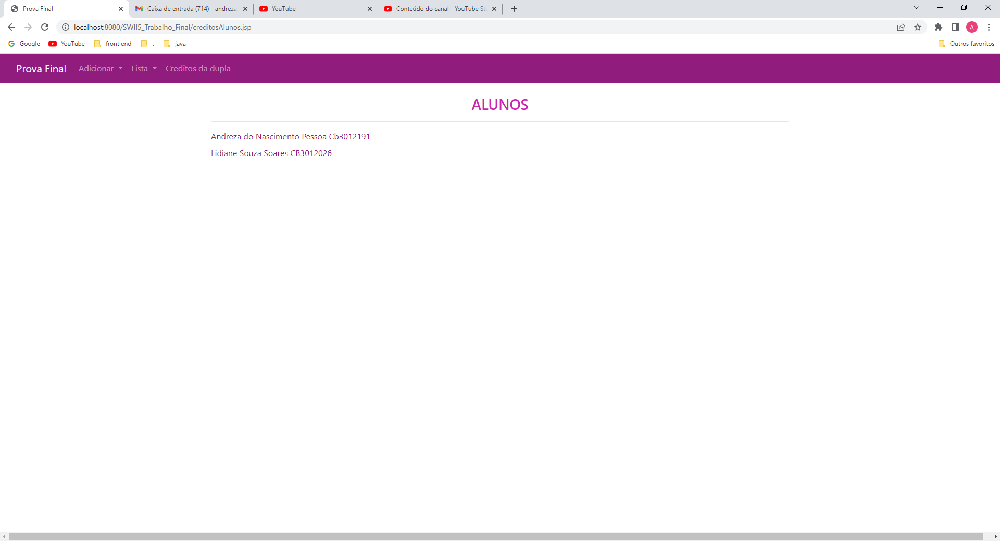
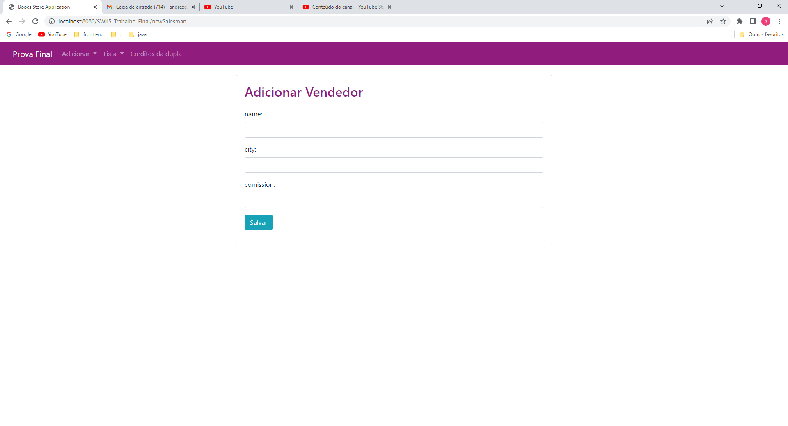
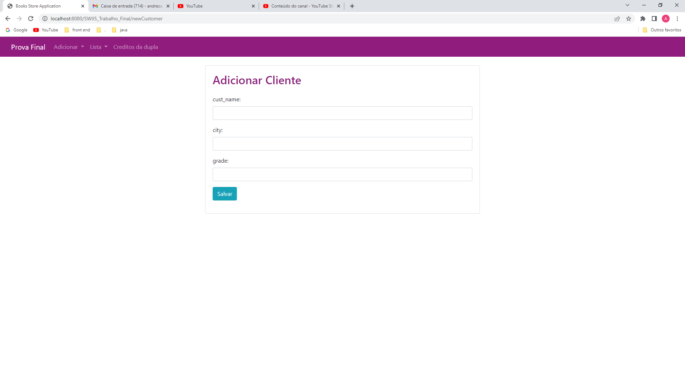
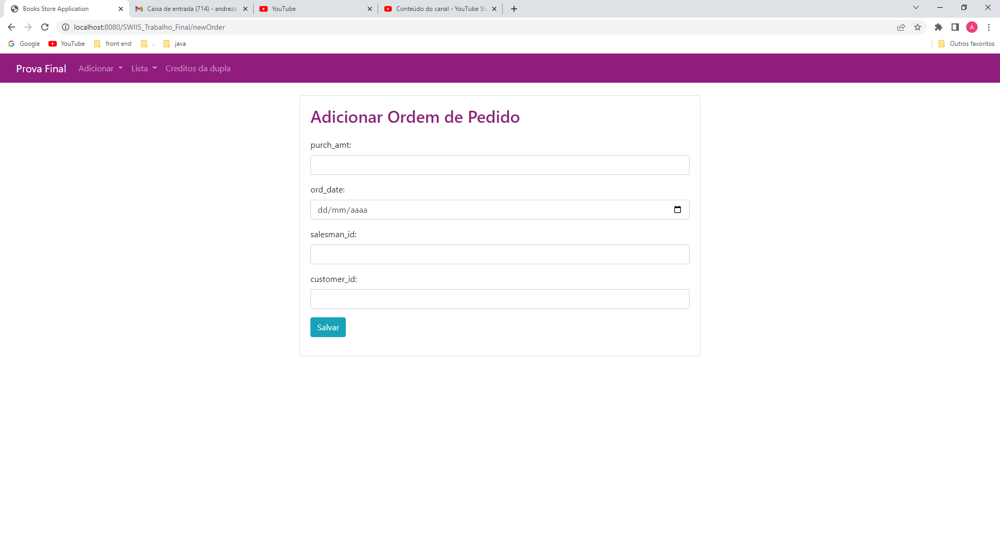
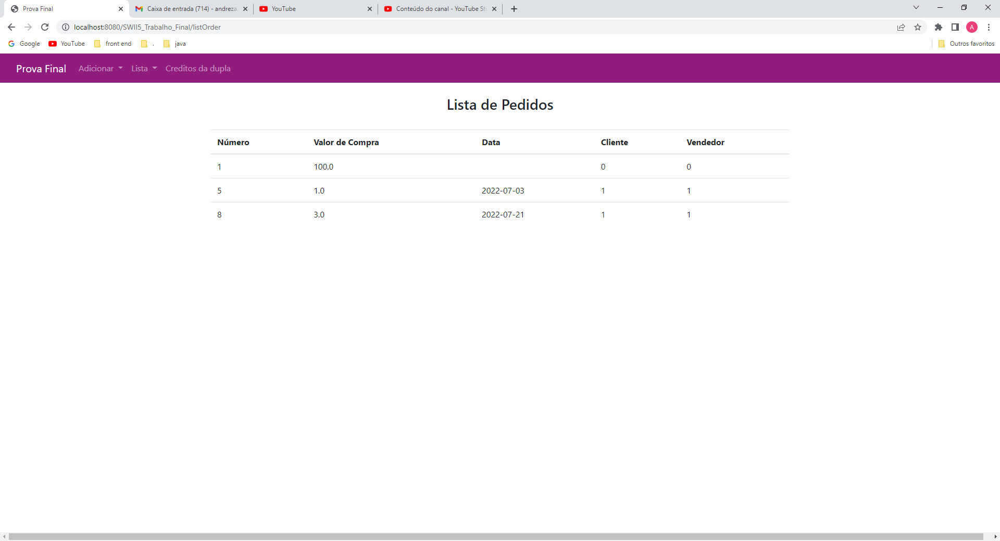
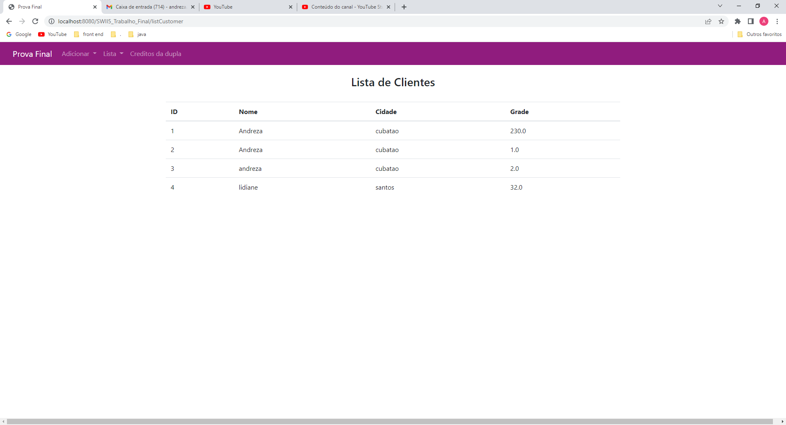
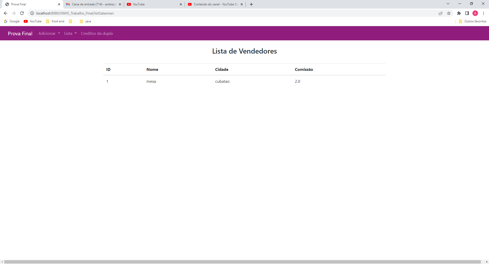

# SWII5  - Prova Final

## Requisitos

Atenção:

[x]  Obrigatório o nome da dupla nos arquivos .java na forma de comentários.

[x] Deverá entregar o projeto em forma compactada (toda a pasta)

[x] Diferencial: Criar uma página específica para créditos da dupla.

## Demonstração

### Creditos da dupla

### Adicionar vendedor

### Adicionar Cliente

### Adicionar Ordem de Pedido

### Lista de Pedidos

### Lista de Clientes

### Lista de vendedor

Link do projeto funcionando: https://youtu.be/FoV0TYhVm4c

## Autores

- Andreza do Nascimento Pessoa  Matricula: Cb3012191
- Lidiane Souza Soares  Matricula: CB3012026
